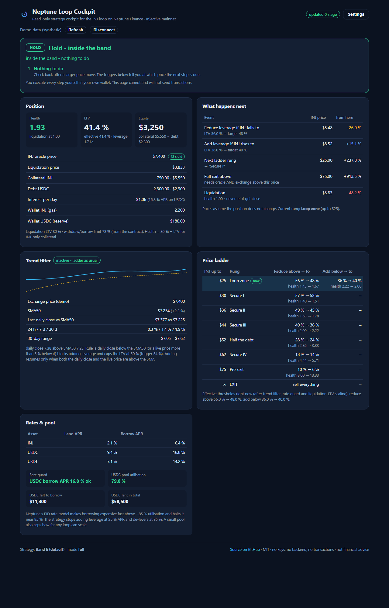

# Neptune Loop Cockpit

**Cockpit and autopilot for the INJ collateral loop on [Neptune Finance](https://nept.finance) (Injective).**
Connect Keplr or Leap, or paste any `inj1…` address: the page shows the position's health, LTV and liquidation price, runs the loop strategy's rulebook against it and tells you the next move with concrete amounts. With a wallet connected you can let it execute those moves for you, either confirming each transaction or through a session key with narrowly scoped, expiring permissions. There is no backend and your wallet key never leaves your wallet.



- **Read-only by default.** Watching an address, the demo, and a connected wallet without the autopilot never sign anything.
- **A documented, back-testable strategy.** Price ladder, health band, SMA trend filter, interest-rate guard, pool-capacity guard and data-plausibility checks in one pure function ([`src/strategy/policy.ts`](src/strategy/policy.ts)).
- **Concrete plans.** "Repay $612: withdraw 121 INJ, sell on Helix, repay", with the LTV and health after and the prices at which the next step triggers.
- **An autopilot that inherits a production executor.** Withdraw-sell-repay rounds under an interim-LTV cap, reserve-first repayment, depth-sized orders with worst-price protection, fill verification, unclear-outcome handling, cleanup on failure. 113 unit tests including a fault-injection mock chain. Runs in the browser tab or headless 24/7.
- **Session keys instead of exported wallets.** One transaction grants a browser-generated key the right to call four Neptune messages, place market orders on two Helix markets and pay gas from a 0.5 INJ allowance, all expiring together. Revoke in one transaction.
- **Your parameters.** The whole strategy is a JSON object you can edit, store locally and back-test with the included simulator.
- **Honest about the odds.** The documentation says where the strategy loses and why the backtest has about five independent observations. Read [docs/RISKS.md](docs/RISKS.md) first.

---

## What the loop is

You deposit INJ as collateral on Neptune, borrow USDC against it, buy more INJ with the USDC and deposit that too. The result is a leveraged long INJ position (leverage = 1 / (1 − LTV); at the default target LTV 40 % that is 1.67×). Interest on the USDC debt is the running cost; a fast enough crash liquidates you.

The strategy keeps the LTV inside a band, de-levers when the price falls, adds leverage when it rises (only below $25, only in an uptrend), steps the leverage down through a price ladder above $25 and exits fully above $75. Full write-up: [docs/STRATEGY.md](docs/STRATEGY.md).

## Quick start

**Use it:** open `https://paddy-droid.github.io/neptune-loop-cockpit/` — or run it yourself:

```bash
git clone https://github.com/paddy-droid/neptune-loop-cockpit.git
cd neptune-loop-cockpit
npm install
npm run dev          # http://localhost:5173
```

Connect Keplr / Leap, paste an address, or click **Open demo** (synthetic data). Deep links: `?address=inj1…` (watch-only), `?demo=1`.

**Autopilot in the browser:** connect a wallet → Autopilot card → choose "confirm each transaction" or create a session key and grant it → acknowledge → Start. Full guide: [docs/AUTOPILOT.md](docs/AUTOPILOT.md).

**Autopilot 24/7 (headless):**

```bash
npm run session -- --out ./session.key                 # prints the session address; grant it in the cockpit
npm run autopilot -- --owner inj1you --key-file ./session.key --webhook https://ntfy.sh/your-topic
npm run autopilot -- --owner inj1you --key-file ./session.key --dry-run --once   # what it would do, never executes
```

**Command line status** (same numbers as the page):

```bash
npm run status -- inj1yourAddress [--json]
```

**Back-test the default ladder** against INJ history since 2020:

```bash
npm run backtest              # named windows, variants side by side
npm run backtest -- --rolling # every 12-month window, summary statistics
npm run backtest:fetch        # refresh backtest/data/inj_daily.json from Binance
```

## What you see

| Card | Content |
|---|---|
| **Decision** | HOLD / REDUCE LEVERAGE / ADD LEVERAGE / EXIT / DATA ERROR with the reason, amounts (USD, INJ, wallet share, withdraw rounds), LTV/health after, and a step-by-step checklist with links to the Neptune app and Helix. |
| **Autopilot** (wallet connected) | Signing mode, session key and its three grants, settings, acknowledgement, start / stop / pause / emergency stop, tick countdown, log with transaction links. |
| **Position** | Health, LTV, effective LTV, leverage, equity, collateral, debt, liquidation price, oracle age, interest per day, wallet gas / reserve. |
| **What happens next** | INJ prices at which the next reduce / add / rung / exit / liquidation sit, and how far away they are. |
| **Trend filter** | 60-day sparkline with SMA, live vs SMA, last daily close vs SMA, filter state and why. |
| **Price ladder** | All rungs with trigger / target LTVs and health equivalents, current rung highlighted, effective thresholds after filters. |
| **Rates & pool** | Lend / borrow APRs, rate-guard state, USDC pool utilisation and free liquidity. |
| **Settings** | The strategy JSON, LCD hosts. Stored in your browser only. |

## How it works

```
browser / node ──► Injective LCD ──► Neptune contracts (smart queries)      read
               ──► Binance / CoinGecko (daily candles, 1-minute candles)    read
               ──► Helix indexer (order books)                              read
               ──► decide() ──► guards ──► engine (rounds) ──► signer        write (autopilot only)
                                             │
                    Keplr / Leap popup ◄──────┴──────► session key → MsgExec (authz + feegrant)
```

Everything runs client-side or in your own Node process. [docs/ARCHITECTURE.md](docs/ARCHITECTURE.md) explains the modules, [docs/NEPTUNE-CONTRACTS.md](docs/NEPTUNE-CONTRACTS.md) the exact queries and messages, [docs/AUTOPILOT.md](docs/AUTOPILOT.md) the execution rules and the grant model.

## Project layout

```
src/config      chain constants (contracts, assets, LCD hosts, links)
src/chain       LCD client with failover, Neptune status reader (fetch + pure parser)
src/market      daily candles + trend filter (pure computeTrend)
src/strategy    types + defaults, decide(), planner (amounts, rounds, triggers)
src/execution   engine (rounds), guards, tick orchestration, order-book maths, markets,
                signers (wallet / session), chain ports, session grants, fingerprint,
                browser runner, lazily loaded SDK bundle
src/wallet      Keplr / Leap address-only connection
src/ui          React app (no UI library), autopilot panel
scripts         status-cli.ts, autopilot.ts (headless runner + session key generator)
backtest        no-look-ahead simulator, runner, data
tests           vitest: strategy, planner, trend, parsing, engine on a mock chain, tick, grants
docs            strategy, autopilot, architecture, contracts, risks, manual execution, roadmap, FAQ
```

## Development

```bash
npm run typecheck   # tsc --noEmit
npm test            # vitest (113 tests)
npm run build       # production build to dist/ (the Injective SDK is a lazily loaded chunk)
```

CI runs typecheck, tests and build on every push and pull request; `main` deploys to GitHub Pages. Contributions: [CONTRIBUTING.md](CONTRIBUTING.md). Security: [SECURITY.md](SECURITY.md).

## Status and disclaimer

Version 0.2.0. The strategy and the execution engine are ports of the author's private system that has run this loop live since August 2026 through ten internal audit rounds. What is new in this repository, the wallet and session-key signing and the browser runner, has been tested against a mock chain and read-only against mainnet, but **not yet with real transactions by anyone but the author**. Start in confirm mode with a small target. Default parameters are the author's live parameters and will not be tuned to look better in the backtest ([why](docs/STRATEGY.md#4-backtest-honesty)).

**This is not financial advice.** A leveraged loop on a volatile asset can lose everything, and has done so in most historical 12-month windows. An autopilot removes the delay between a rule and a trade, not the risk in the rule. Neptune Finance is a third-party protocol with its own smart-contract, oracle and governance risk. Use amounts whose total loss would not hurt you. The authors accept no liability. License: [MIT](LICENSE).
