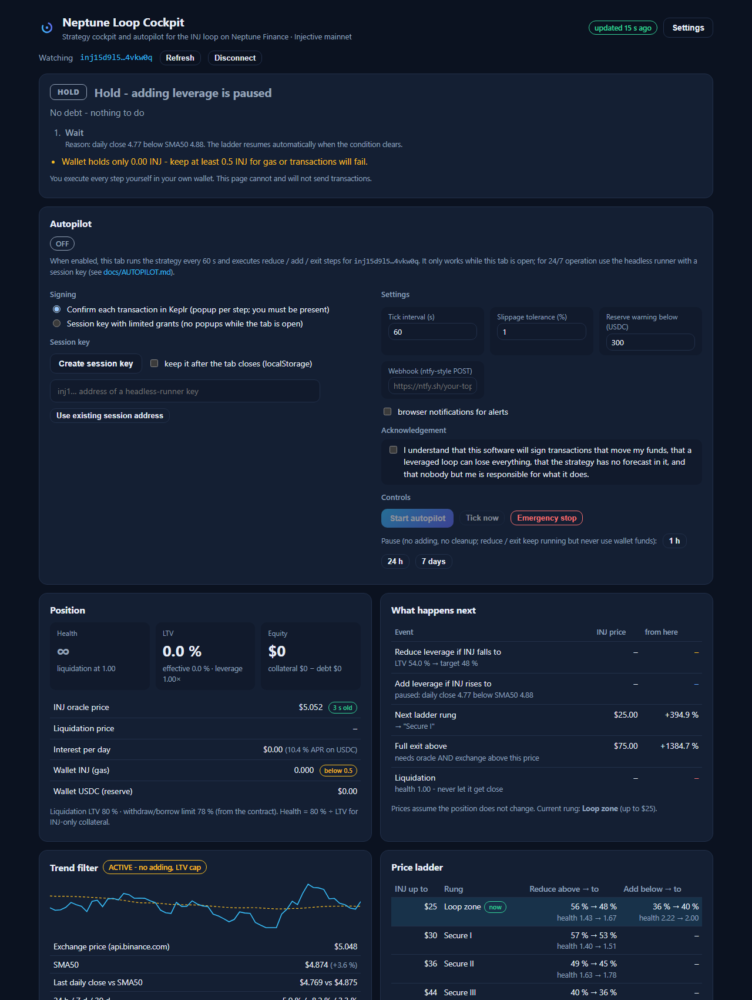

# Autopilot

The autopilot executes the strategy for you: it reads the position, runs `decide()`, applies the guards, and when a reduce / add / exit is due it performs the steps (withdraw → sell → repay, borrow → buy → deposit) as separate, verified transactions. It is the execution half of the author's production system, ported with its rules intact and with the signing made pluggable.

Read [RISKS.md](RISKS.md) first. Then read this page to the end before you start it.



## Two ways to sign

| | Confirm each transaction | Session key |
|---|---|---|
| Who signs | Your wallet extension (Keplr / Leap), one popup per step | A key generated in your browser, signing `MsgExec` on your behalf |
| What you approve | Every single transaction, as it happens | One transaction up front: three limited grants |
| Runs when | Only while you sit at the tab and click "Approve" | While the tab is open (browser) or 24/7 with the headless runner |
| Owner key exposure | None beyond normal wallet use | None: the session key cannot spend, transfer or sign anything outside the grants |
| Revoke | Close the tab | One transaction ("Revoke"), or wait for the expiry |

A step sequence like "reduce leverage" is 3 transactions per round and often 2–3 rounds. With confirm-mode you will click "Approve" up to ten times within a couple of minutes, and the rounds have a time budget: if you are slow, the run defers and continues at the next tick. Confirm-mode is the right choice for a first test with a small target, and for people who never want a key outside their extension. Session mode is what "automated" actually means.

## What the session key may do (and may not)

The grant transaction contains exactly three messages:

1. **`ContractExecutionAuthorization`** (CosmWasm authz) for the Neptune **market contract only**, with a message-key filter of `withdraw_collateral`, `return`, `borrow`, `deposit_collateral` and a call limit (1,000 by default). The session key cannot call any other contract, cannot send a `MsgSend`, cannot stake, cannot vote.
2. **`CreateSpotMarketOrderAuthz`** (Injective exchange authz) for **market orders only**, on the two Helix markets INJ/USDC and USDC/USDT, for your **default subaccount only**. No limit orders, no derivatives, no other markets.
3. **`BasicAllowance`** (feegrant) of 0.5 INJ so the session key can pay gas from your account. It never holds INJ itself.

All three carry the same expiry (1, 7 or 30 days). Everything the session key does is executed **as you** through `MsgExec`; funds only ever move between your wallet, your Neptune account and your Helix subaccount. The worst case if the key leaks: an attacker can run the same four Neptune messages and market orders on your position until the grant expires or you revoke — i.e. they could de-lever you at a bad price or sell INJ into USDC in your own wallet. They cannot withdraw anything to another address.

You can inspect the live grants at any time: the panel shows them, and so does `GET {lcd}/cosmos/authz/v1beta1/grants?granter=<you>&grantee=<session>`.

## Setting it up (browser)

1. Connect Keplr or Leap. The **Autopilot** card appears under the decision.
2. Choose the signing mode.
3. For session mode: **Create session key** (optionally tick "keep it after the tab closes" — otherwise it lives in `sessionStorage` and dies with the tab), then **Grant 7 days**. Your wallet shows one transaction with three messages; approve it. The three rows turn green.
4. Settings: tick interval (60 s default), slippage tolerance (1 %), reserve warning, optional webhook URL for alerts (any ntfy-style endpoint that accepts `POST` with a `Title` header), browser notifications.
5. Read and tick the acknowledgement.
6. **Start autopilot.** The card shows RUNNING and the next tick countdown. The log below lists every tick and every step with its transaction hash.

Only one tab per address can run the autopilot (enforced with the Web Locks API). Closing the tab stops it; after a reload it is always OFF until you start it again.

## Headless runner (24/7)

The same tick runs in Node without a browser:

```bash
npm run session -- --out ./session.key          # prints the session address
# in the cockpit: Autopilot -> "Use existing session address" -> paste -> Grant 7 days (wallet signs once)
npm run autopilot -- --owner inj1yourAddress --key-file ./session.key --webhook https://ntfy.sh/your-topic
```

Options: `--interval 60`, `--state ./autopilot-state.json`, `--strategy ./strategy.json` (exported from the cockpit's settings), `--dry-run` (never executes, prints what it would do), `--once` (one tick). `Ctrl+C` finishes the current round, then stops. Alternatively export the browser's session key with "Export for the headless runner" and put the hex into the key file; the grants stay the same.

Run it on a machine that stays online (a small VPS, a Raspberry Pi, a NAS). Put the process under a supervisor (`systemd`, `pm2`, Docker restart policy) and watch the webhook: a runner that silently died is the most common failure of any bot.

## What a tick does

```
status + trend + fingerprint
  -> decide()                       (docs/STRATEGY.md)
  -> continue a deferred reduce?    (LTV still > target + 3 points)
  -> fingerprint changed?           block adding 24 h + alert
  -> paused?                        no adding; reduce/exit still run without wallet funds
  -> adding: cooldown 30 min since the last own buy, threshold held >= 15 min
  -> autopilot disabled?            report only
  -> idle + orphaned wallet INJ > 2 -> deposit them
  -> execute (reduce / add / exit)
  -> alerts (throttled per key), log, persist small state
```

Execution rules (from [`src/execution/engine.ts`](../src/execution/engine.ts)):

- **Reduce:** wallet USDC repays first (no INJ sale, works with a stale oracle). Then rounds of withdraw → sell → repay. Each withdraw keeps the interim LTV ≤ 70 % (≥ 4 LTV points per step when already above it, never above the contract limit − 1 point). Sales are sized by the bid depth within 2 % (max 40 % of it), with a worst price of VWAP − slippage and never worse than 3× slippage below the best bid. Fills are verified against the bank balance; partial fills are used as they are. A sale rejected clearly is retried once with a fresh book; a sale with an unclear outcome is never repeated — the code waits for the fill. Withdrawn but unsold INJ is always sold before anything new is withdrawn, and the cleanup on any error sells it and repays.
- **Add:** borrow → buy (limit at VWAP + slippage, never more than 2 % above the oracle) → deposit. The wallet USDC present at the start is the reserve and is never spent; borrowed USDC that could not be converted is returned to the debt immediately.
- **Exit:** reduce to zero debt (USDT debt is rotated via USDC/USDT), then withdraw everything and sell all but ~1.5 INJ.
- **Time budget** 230 s per tick; the next tick continues. **Stop / pause** is honoured at every round boundary; wallet funds are not touched after a pause.
- **Data errors** (stale oracle, implausible health×LTV, NaN) never execute, except the protective reduce on fresh exchange data when the oracle is stale.
- **Address check:** the signer's account must equal the position's address, every tick.

## Alerts

| Key | When | Level |
|---|---|---|
| `start-*`, `done`, `deferred` | an execution starts / finishes / is continued next tick | info |
| `aborted` | an execution failed (cleanup attempted) | urgent |
| `dataerror`, `wallet-only`, `exit-wait` | inputs untrustworthy / only wallet USDC can repay / exit waits for confirmation | urgent |
| `crit`, `warn` | health below 1.15 / 1.30 | urgent / warn |
| `fingerprint`, `liqltv` | Neptune contracts or parameters changed | urgent |
| `gas`, `reserve`, `equity-low` | wallet INJ < 0.4 / reserve below the threshold / equity < $1,500 | warn / info / urgent |
| `usdt` | debt is not USDC | urgent |
| `cleanup-ok`, `cleanup-fail` | orphan INJ deposited / could not be | info / warn |
| `monitor-error` | the tick itself threw | warn |

Each key is throttled (e.g. `crit` every 5 min, `warn` hourly). The webhook receives `POST <url>` with the body and a `Title` / `Priority` header, which is what [ntfy.sh](https://ntfy.sh) expects; most alert relays accept the same shape.

## First run checklist

1. Test in **confirm mode** with the strategy set to `repay-only` and a position whose LTV is inside the band: the autopilot should tick and say HOLD. Then move the reduce trigger in the settings 2 points below your current LTV, tick, and approve the three transactions of one round. Reset the trigger.
2. Watch the log: every step should show a tx hash and the "result" line at the end.
3. Only then switch to session mode with a 1-day grant, and only after that extend to 7 or 30 days.
4. Keep ≥ 0.5 INJ in the wallet for gas at all times and a USDC reserve the strategy can repay from.
5. Have the [MANUAL-EXECUTION.md](MANUAL-EXECUTION.md) checklist ready: when the autopilot reports DATA ERROR or ABORTED during a crash, you are the fallback.

## Known limitations

- **Browser mode stops when the tab sleeps.** Mobile browsers and aggressive power saving suspend timers. Use the headless runner for anything you rely on.
- **One address per runner, one runner per address.** Two runners on the same address would fight over the interim state; the browser enforces this per browser profile, not across machines. Do not run the browser autopilot and the headless runner for the same address at the same time.
- **Price data dependencies:** Binance (or its mirror, or CoinGecko) for the SMA and the hold check; the indexer for order books. If the hold check has no price history it falls back to the runner's own samples (needs ≥ 15 min of ticks).
- **USDT / AUSD debt** is only repaid during a full exit; the reduce path expects USDC debt and asks you to rotate otherwise.
- **The session key is only as safe as the browser profile / file it lives in.** Use short expiries. Revoke when in doubt; it costs one transaction.
- **No simulation of your position in advance.** The plan on the decision card is the preview; the engine recomputes with live books at every step.
